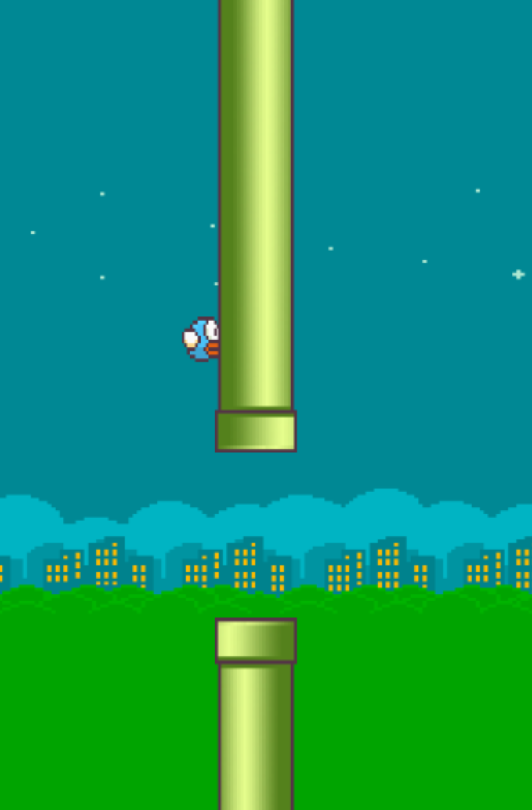

# Flappy Bird 게임 만들기

## 계획

1. ~~Create Bird~~ (2023-07-02)
2. ~~Add gravity~~ (2023-07-02)
3. ~~Make bird fly~~ (2023-07-02)
4. ~~Create and move obstaclse~~ (2023-07-03)
5. ~~Make Game over - collision detect~~ (2023-07-03)
6. ~~Add sprite - background~~ (2023-07-04)
7. ~~Add sprite - bird~~ (2023-07-04)
8. ~~Add sprite - obstacle~~ (2023-07-05)
9. ~~Add sprite - ground~~ (2023-07-06)

## 최종기록

## 본 프로젝트에서 얻은 경험

- 자바스크립트로 프로그래밍 하는 능력이 향상되었음을 실감할 수 있었음
- 처음부터 클래스를 이용하여 작성하였고 상속도 이용하여 코드의 중복을 피함
- 클래스를 이용하고 파일을 따로 분리함 꽤나 깔끔한 구성을 할 수 있게됨

## 이미지 출처

[flappy bird](https://github.com/samuelcust/flappy-bird-assets/tree/master/sprites)
